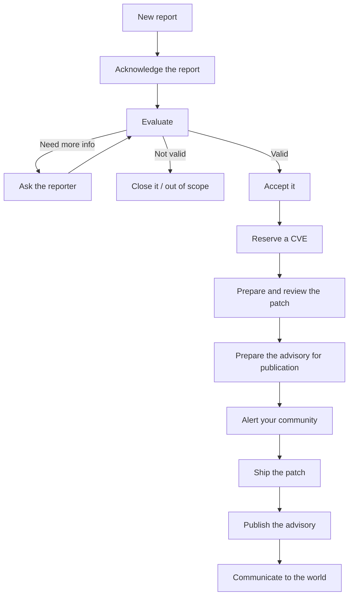
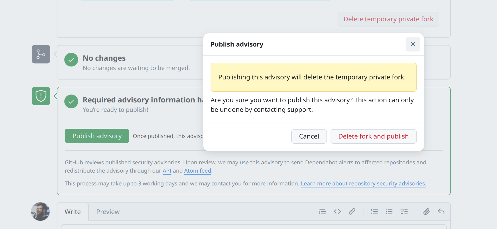

# The Maintainer's Guide to GitHub Security Advisories

> So you got your first GHSA. Don't panic.

> [!NOTE]
> Last verified against GitHub's behavior: July 2026.

> [!IMPORTANT]
> Draft under review before the first release. Corrections and feedback are welcome.

## How to use this guide

- Do not read it zero-to-hero. Jump to the stage you are at.
- Expect to come back over several days. Most advisories take that long to close.
- Each section stands on its own, with a "You are here if" signpost and a short checklist at the top.

## A word on your authority

You are not a service desk. You decide what is in scope, when things happen, and whether a report is even yours to act on.

- Stay in control of the situation as much as you can, and set the pace yourself.
- If the vulnerability is real, keep it out of public view until a fix exists. The world should not learn of it before users can protect themselves. That is the core principle of coordinated disclosure (the reasoning is in [§1](#1-getting-oriented); the references are in [Resources](RESOURCES.md#disclosure-principles-and-philosophy)).
- You do not owe anyone anything, even while handling a security report. See [Open Source Maintainers Owe You Nothing](https://mikemcquaid.com/open-source-maintainers-owe-you-nothing/).

## The lifecycle at a glance



## Table of contents

1. [Getting oriented](#1-getting-oriented)
2. [Reading the advisory](#2-reading-the-advisory)
3. [Acknowledging the report](#3-acknowledging-the-report)
4. [Triaging the report](#4-triaging-the-report)
5. [Preparing the fix](#5-preparing-the-fix)
6. [Preparing the advisory](#6-preparing-the-advisory)
7. [Coordinating publication](#7-coordinating-publication)
8. [Wrapping up](#8-wrapping-up)
9. [Building for the long term](#9-building-for-the-long-term)
10. [Getting help](#10-getting-help)

_Looking for the gotchas checklist? It lives in the [Cheatsheet](CHEATSHEET.md#avoiding-the-gotchas)._

---

## 1. Getting oriented

> **You are here if:** a private report just landed in your Security tab and you are not sure what to do.

**TL;DR**
- Vulnerabilities are handled in private for one reason: a public bug is a public exploit before users can patch.
- The mental model: a private workspace, a public moment when you publish, and very little in between that the world ever sees.
- The three don'ts: don't take it public, don't go silent, don't panic.

Before any of the mechanics, two mental models make the rest of this guide make sense: why this is private at all, and how GitHub's advisory machinery is shaped around that.

### Why it is private: the disclosure-risk model

A normal bug you fix in the open. A security bug you do not, and the reason is timing. The moment a vulnerability is visible (in an issue, a pull request, a commit, a post), the clock starts for every user who has not patched, and attackers read public repositories faster than maintainers do. Disclose before there is a fix and you have handed out a working exploit while leaving everyone exposed.

So the whole game is sequencing: keep the vulnerability private until a fix exists and is released, then disclose. Everything GitHub gives you here (the private report, the draft advisory, the temporary private fork) exists to let you build and ship the fix without tipping anyone off first. This is the principle the rest of the guide keeps coming back to. (The references are in [Resources](RESOURCES.md#disclosure-principles-and-philosophy).)

That quiet window between a private report and public disclosure has a name: the **embargo**. It is the period everyone who knows agrees to hold off while the fix is built and shipped. An embargo is a social agreement, not a GitHub setting: its length is whatever you, the reporter, and any coordinated parties agree to, often anchored to the reporter's own disclosure deadline. You negotiate it and you manage it; nothing enforces it for you (more on timing in [§7](#7-coordinating-publication)).

### How GitHub's advisory works: the mental model

Three things to hold in your head:

- **A private workspace.** The draft advisory, its conversation, and the temporary private fork are all private to you and the collaborators you add. This is where the work happens.
- **A public moment.** When you click publish, the advisory record goes public and flows out to the wider ecosystem. Before that, nothing does.
- **Very little crosses over.** Of the whole private conversation, only the reporter's original report becomes public on publication; the rest stays private forever ([§2](#2-reading-the-advisory) covers exactly who sees what).

### The three don'ts

- **Don't take it public.** No public branch, no public pull request, no "fixing a security issue" commit message, no details in an issue, until the advisory is out ([§5](#5-preparing-the-fix), and the [cheatsheet gotchas](CHEATSHEET.md#avoiding-the-gotchas)).
- **Don't go silent.** Acknowledge the report, even before you have assessed it. Silence is what makes a reporter escalate ([§3](#3-acknowledging-the-report)).
- **Don't panic.** You almost always have more time and more control than it feels like in the first five minutes. The rest of this guide is the calm version of what to do next.

---

## 2. Reading the advisory

> **You are here if:** you opened the advisory and want to understand what you are looking at, and who can see it.

**TL;DR**
- A private report shows up as a draft advisory in your repository's Security tab, not in Issues.
- While it is a draft, everything is private to the repo admins, the reporter, and collaborators you add.
- On publish, the advisory record and the reporter's original report become public; the rest of the conversation never does.

The advisory is not a normal issue, and the thing that trips up first-timers most is visibility: what is private now, what becomes public later, and what never does. Get that straight before you type anything.

### Where it lives

A privately reported vulnerability arrives as a draft advisory, a **GitHub Security Advisory** (GHSA), in your repository's **Security** tab under Advisories, not in Issues. It is created the moment the reporter submits, and it is private from the start. From it you run the whole process: talk with the reporter, open the temporary private fork ([§5](#5-preparing-the-fix)), fill in the record ([§6](#6-preparing-the-advisory)), and eventually publish.

### Who can see what

This is the part worth getting exactly right:

- **While it is a draft:** the advisory, its fields, and its entire conversation are visible only to the repository admins, the reporter, and any collaborators you add. Not the public, and not your other contributors.
- **When you publish:** the advisory record (description, affected versions, severity, CWE, CVE, credits) becomes public and flows to the [GitHub Advisory Database](https://github.com/advisories) and Dependabot ([§6](#6-preparing-the-advisory)).
- **What crosses over from the conversation:** only the reporter's original report. Everything after it (your questions, the team's discussion) stays private forever, visible only to the advisory's collaborators.

Two consequences to internalize now:

- **The reporter's first message will be public.** They wrote it, but you publish it. Before going live, check it for raw proof-of-concept detail you would rather not broadcast, and coordinate with them if needed ([§6](#6-preparing-the-advisory)).
- **The thread is a safe space, with one caveat.** Because the rest of the conversation stays private, it is where you and your team work. But the reporter is in that thread too, so for team-only discussion, like a borderline scope call, step off the advisory ([§4](#4-triaging-the-report)).

---

## 3. Acknowledging the report

> **You are here if:** you are about to reply to the reporter for the first time.

**TL;DR**
- Acknowledging is optional, but unless you are starting the evaluation right now, it is the most important early move.
- Reply within a couple of days. The acknowledgment matters more than having a verdict.
- Thank them, confirm you received it and are treating it as a security issue, and say what happens next.
- You decide whether the report is valid later, in [triage](#4-triaging-the-report), not here.

The first thing to do is the easiest thing to get wrong: reply. Not fix, not triage, just acknowledge. You do not need to have assessed anything yet. You just need to show up.

### Why this matters

Until you reply, the reporter has no way to know the report even reached you. A private report is silent by design: there is no "delivered" receipt, no public trace, nothing. If you are not starting the evaluation right away, this acknowledgment is the only signal they get.

Most reporters expect to hear back within a few days. If they do not, they have a few ways to keep things moving on their own, and each one means the process continues without you steering it:

- **Reaching you another way:** through your foundation, if you have one, or by email, social, or your co-maintainers.
- **Disclosing early:** a public issue, a pull request against the public repo, or a blog post. This is the risk explained in [§1](#1-getting-oriented).
- **Getting a CVE elsewhere:** depending on your CNA, a last-resort CNA can assign one without you in the loop (see [§6](#6-preparing-the-advisory)).

### What are my goals?

A first reply has three jobs:

- **Reassure.** Let them know you are aware and taking it seriously.
- **Establish a channel.** Make the advisory thread the single place this conversation happens.
- **Win time, control expectations.** A reporter who feels heard, knows what happens next, and has a rough timeline is usually willing to wait. Setting those expectations early is the cheapest insurance you have against a premature disclosure.

### What to send

Keep it short, warm, and specific. A good acknowledgment has four parts:

- **Thanks.** They reported privately instead of dropping an exploit in public. That is a favor, even if the report turns out to be wrong.
- **Receipt.** Confirm you have it and are treating it as a security issue, even if you have not evaluated it yet.
- **Next step and timing.** Tell them what you will do next (assess whether it is in scope) and when you will next be in touch. Promise a window you can keep: an initial assessment in a few days, not a fix by Friday.
- **Their timeline.** Ask whether they already have a planned disclosure date or are coordinating with anyone else. This surfaces the embargo clock early, while you can still shape it (see [§7](#7-coordinating-publication)).

Stay polite even if the report looks thin; you decide whether it holds up in [triage](#4-triaging-the-report), not in this reply.

Here is a real acknowledgment, linking the project's security policy and threat model so the reporter can see how triage works:


<details>
<summary>Acknowledgment template (copy and adapt)</summary>

```
Hi [reporter],

Thank you for reporting this vulnerability. We have received your submission and will review it promptly.

You can find more about how we triage in our [Security Policy](LINK) and [Threat Model](LINK).

We will keep you updated on our progress.
```

Link "Security Policy" and "Threat Model" to your own `SECURITY.md` and threat model (see [§4](#4-triaging-the-report)). Use "I" instead of "we" if you maintain the project alone.

</details>

Whether and how to credit them can wait; you do not need to settle it now (see [§8](#8-wrapping-up)).

> [!NOTE]
> If the report arrived somewhere public (a normal issue, a discussion, social media), your first move is different: get it out of public view fast, then acknowledge privately. See the [cheatsheet gotchas](CHEATSHEET.md#avoiding-the-gotchas).

---

## 4. Triaging the report

> **You are here if:** you have acknowledged the report and need to decide what to do with it: accept, reject, rescope, or send it elsewhere.

**TL;DR**
- Triage answers four questions, in order: can you reproduce it, is it actually a security issue, is it in your scope, and is it yours to fix?
- Treat the report as a set of claims to verify, not facts. Nobody checks a submission before it reaches you.
- You have the right to say no. "Out of scope" and "not a vulnerability" are legitimate, common outcomes.
- Decide validity and scope here. How bad it is comes later, in [§6](#6-preparing-the-advisory).
- Reject with your reasoning, not a brush-off. A dismissed reporter is the one who escalates.

### Why this matters

Triage is where your authority is real (see [A word on your authority](#a-word-on-your-authority)). Most first-timers assume that once a report arrives, they are obligated to fix it. You are not. A report has to clear several bars before it becomes your problem:

- Not every report is valid.
- Not every valid bug is a security issue.
- Not every security issue is in your scope.
- Not every in-scope issue is yours to fix.

You decide where each report falls. Saying no, clearly and kindly, is a normal outcome, not a failure.

### What you are deciding

Treat everything in the report as a claim, not a fact. Nobody verifies a submission before it reaches you: some are thin, some are wrong, and some are long AI-generated text with very little inside. Your job is to check, never to assume the reporter is right.

Work through four questions in order. The first "no" usually settles it.

1. **Can you reproduce it?** Follow the steps. If you cannot, ask the reporter for a clearer proof of concept before you judge it. "I could not reproduce it" is a request for more information, not a verdict.
2. **Is it actually a security issue?** Plenty of reports are real bugs, expected behavior, or feature requests wearing a security costume. A crash on input you never promised to handle, or a "weakness" that needs the admin access you already trust, may not be a vulnerability at all.
3. **Is it in your scope?** Your threat model is the yardstick: does the report assume access, configuration, or conditions you never promised to defend against? If your project never claimed to sandbox untrusted plugins, "a malicious plugin can do X" may be out of scope by design.
4. **Is it yours to fix?** The flaw may live in a dependency, in upstream, or in how the user configured things. If so, it belongs to someone else, even if you end up bumping a version to pick up their fix.

> [!WARNING]
> Do not download or run binaries, archives, or proof-of-concept files attached to a report. A security advisory is an untrusted input surface like any other: read the code, do not execute a stranger's payload.

> [!TIP]
> If a report is confusing or reads like long AI-generated filler, run the original text through an LLM to get a distilled summary and a minimal proof of concept you can test. If you find yourself doing this often, it is worth investing in better prompts or tooling to keep the output accurate.

Each question has an exit:

- **Accept** it and move on to [preparing the fix](#5-preparing-the-fix).
- **Close** it as out of scope or not a vulnerability.
- **Redirect** it to the dependency or upstream project that owns it.
- **Rescope** it: real, but a hardening or a lower-impact issue rather than the vulnerability as reported. (How bad it is is a [scoring](#6-preparing-the-advisory) question, not a triage one.)

> [!TIP]
> The moment you accept a report, you can reserve its CVE (see [§6](#6-preparing-the-advisory)). Getting a number assigned can take time, so reserving early means it is ready when you publish, instead of becoming the thing everyone waits on at the end.

### What GitHub gives you here

At this stage GitHub offers four actions, and nothing else:


- **Start a temporary private fork** — collaborate on a fix privately (see [§5](#5-preparing-the-fix)).
- **Accept and open as a draft** — accept the report and keep working as a draft advisory. GitHub even reminds you to review carefully first.
- **Comment** — reply without deciding yet, for example to ask for a clearer proof of concept.
- **Close security advisory** — decline it. A comment is not required, but always leave one.

There is also no way to give reporters a submission template the way you can for issues or pull requests, so reports arrive in wildly varying shape and quality (see [LIMITATIONS.md](LIMITATIONS.md)).

### Editorial criteria

Triage is only as fast as your sense of scope is clear. Your editorial criteria is the standing answer to "what do we treat as a vulnerability, and what do we not?" Your threat model, what your project does and does not defend against, is the heart of it: it turns "this feels out of scope" into "this is out of scope, and here is why," and makes a rejection something you can point to rather than argue.

Ideally you wrote it down before the first report arrived. If you have not, this report is the prompt to do it; the how-to lives in [§9](#9-building-for-the-long-term).

Editorial criteria are not fixed, and they should not be. A project's sense of what counts as a vulnerability shifts over time, and a report is often what exposes a boundary you never wrote down. It is perfectly legitimate to respond by documenting that boundary, updating your threat model or your docs, and then closing the report as out of scope under the now-explicit criteria. The report did its job: it made you decide.

The one rule when you shift criteria is transparency. Do not quietly move the goalposts. Tell the reporter you are clarifying scope, point them at the change you made, and credit them for surfacing it. A documented, explained change reads as a project maturing; an unexplained one reads as dodging.

If you triage as a team, the criteria has to be shared rather than living in one person's head, so two maintainers reach the same verdict on the same report. Borderline reports, the ones sitting right on the edge of what you accept, need a safe space to talk through.

There is a catch: **the advisory thread includes the reporter in every interaction.** Anything you post there, they see. So when you need to align the team on a borderline call, do it somewhere separate, without the reporter, then report the decision back in the advisory.

> [!NOTE]
> Referencing an advisory from a pull request or issue does not create the automatic link-back you get between issues and PRs. If you discuss or track an advisory elsewhere, you have to keep those connections yourself. See [LIMITATIONS.md](LIMITATIONS.md).

### Saying no

You are allowed to decline, and you will, often. What matters is how.

- **Give your reasoning.** Reference your scope or threat model, explain why it does not qualify, and thank them for looking. A reasoned "no" lands very differently from silence or a one-line dismissal.
- **Leave the door open.** Invite them back if they can show the missing piece: a working proof of concept, or a scenario that sits inside your threat model.
- **Stay calm if they disagree.** You have the final say on your own project, but a reporter who feels brushed off is the one who escalates, with a public issue, a blog post, or a CVE requested without you (see [§3](#3-acknowledging-the-report)). A respectful rejection is also your reputation talking.

Two real examples. The first closes a report as out of scope by pointing at a named exclusion in the project's threat model:


The second declines a report that is not a real defect, explaining the reasoning plainly:


### Other outcomes

- **Real, but not a security issue.** Close the advisory and handle it as a normal bug or feature in the open.
- **It lives in a dependency or upstream.** Redirect it to the project that owns it. You may still ship a version bump once they fix it, but the advisory is theirs to run.
- **Already known or already fixed.** You may not need to do anything but confirm the fixed version (see [§5](#5-preparing-the-fix)).
- **A hardening idea.** Defense-in-depth worth doing but not an exploitable flaw. Accept it as a normal improvement without a CVE, or decline it. Your call.

---

## 5. Preparing the fix

> **You are here if:** you accepted the report and need to get a fix ready without tipping off the world.

**TL;DR**
- Check whether it is already fixed before you write anything.
- Decide where to work: the temporary private fork, a private clone that keeps your tooling, or even the public repo if early disclosure is not a concern.
- Keep the fix minimal: one focused commit, regression tests where you can, no refactors.
- Test against the oldest runtime and version you support; there is no CI to catch a regression for you.
- Backport to every supported line, and hold the patch until you are ready to publish (see [§7](#7-coordinating-publication)).

The hard part here is rarely the code. It is producing a correct, minimal fix in private, often without the CI and tooling you normally lean on. Three questions follow: is there even a fix to write, where do you write it, and how do you keep it small and correct.

### Is it already fixed?

Sometimes there is nothing to write. Before you open anything, check whether the issue is already resolved:

- It was patched in a later release, and nobody realized the change closed a security hole.
- The reporter included a patch.
- You fixed it earlier as part of an unrelated change.
- Someone proposed a fix in the open. Scan the existing pull requests and issues; the bug may already be solved, in part or in full, in a public PR.

If so, find the exact commit or version that fixes it and confirm it really does, ideally with a test that fails on the vulnerable version and passes on the fixed one. Then move on to [preparing the advisory](#6-preparing-the-advisory).

Already fixed does not mean "no advisory." If the fix is released, you still publish so downstream learns which version to upgrade to. If the fix exists but has not shipped, you may only need to cut a release.

One more case: the vulnerability may only affect versions you no longer actively maintain. Then it is your call whether to ship an extra security release for an old line or to leave it unpatched and say so. Leaving an unmaintained version unpatched is a legitimate choice.

### Where to develop it

Where you build the fix depends on how much you rely on your tooling, and on the nature of the vulnerability.

**The temporary private fork (the dark room).** From the draft advisory, GitHub lets you start a temporary private fork: a private space, tied to the advisory, where collaborators can work on the fix. It is the native option and keeps everything in one place.

The catch is in the name. Your normal workflow does not run here: status checks and Actions do not run, and your organization secrets are unavailable. You are coding with the lights off. Workarounds (running checks locally, a manual test plan, mirroring to a private repo that does have Actions) are tracked in [LIMITATIONS.md](LIMITATIONS.md).

Access is coarse: anyone you add as a collaborator on the advisory can reach the fork, and there is no finer control than that (see [LIMITATIONS.md](LIMITATIONS.md)). Add only the people you need. The reporter can also open their own private fork and push branches or pull requests into it; that is by design.

**A private clone or private repo.** Plenty of maintainers skip the fork entirely and build the fix in a separate private repository, where their CI and secrets work normally. You keep your tooling; in exchange you keep it private and merge the fix back cleanly when you publish.

**The public repo.** If early disclosure genuinely does not matter for this issue, you can also just fix it in the open. That is unusual for a real vulnerability, but it is a valid choice when the risk of tipping people off is low.

Whatever you pick, the patch stays held until you are ready to publish. The fix becomes public the moment you ship the release, so the goal is not "never public" but "not public until you are ready to coordinate the release and the advisory together" (see [§7](#7-coordinating-publication)). Pushing the fix early, to a public branch before you are ready, is the most common way to blow an embargo (see the [cheatsheet gotchas](CHEATSHEET.md#avoiding-the-gotchas)).

### Writing the fix

- **One focused commit.** Fix the vulnerability and nothing else. Drive-by refactors make the change harder to review and much harder to backport.
- **Include regression tests where you can.** They prove the fix works and stop the bug from quietly returning. A test that demonstrates the exploit is fine here; it ships with the patch, not before it. A comment pointing at the advisory helps future readers.
- **Test against the floor.** With no CI, nothing checks that your patch still runs on the oldest runtime, language version, or dependency set you support. Verify that yourself, in private. Merging a patch that breaks compatibility forces you to fix it in public, which opens an early-disclosure window while the release is half-done and the advisory is not out yet.
- **Validate the affected range.** Confirm exactly which versions are vulnerable. You need it for the advisory, and it is what tells you how far to backport.
- **Backport to every affected line you support.** Use that affected range to decide how far back to go; the vulnerability rarely touches only the latest version. Prepare a separate fix commit per branch.
- **Ask the reporter to check.** When the patch is ready, it is worth asking the reporter to confirm it closes the issue and that they cannot find another way around it.
- **Do not skip your hooks.** Reaching for `--no-verify` to get past a pre-commit check is how unsigned or unchecked code slips into a security release (see the [cheatsheet gotchas](CHEATSHEET.md#avoiding-the-gotchas)).

> [!NOTE]
> If you discover a second vulnerability while fixing the first, you can patch both, but give the new one its own advisory rather than quietly folding it into this one.

### Merging the fork (and the squashed commit)

This happens when you ship, in [§7](#7-coordinating-publication), but it shapes how you commit now, so know it in advance.

You cannot merge pull requests individually. GitHub merges all the advisory's open pull requests at once, but each one still lands on its own target branch, squashed into a single commit titled "Merge commit from fork" (your individual commit messages survive only as bullets in that commit's body). A fix backported to three branches produces three squashed merge commits, one per branch, not one combined commit on `main`:


Two consequences:

- **If you rely on commit-format automation** (conventional commits, release tooling, changelog generators), the squashed commit will not match your rules. You may need to amend and force-push it before you tag the release.
- **The history loses context.** Each branch gets one generic commit, which is why reconstructing the story afterward takes deliberate effort (see [§8](#8-wrapping-up)).

> [!TIP]
> Referencing the advisory in your commit messages is safe and worth doing. The GHSA and CVE are not publicly visible until you publish, so the links simply resolve later.

---

## 6. Preparing the advisory

> **You are here if:** the fix is ready or identified, and you are completing the advisory record before publishing.

**TL;DR**
- The advisory is a machine-readable record, not a blog post. Scanners and Dependabot read it; write for them.
- Get the affected and patched versions exactly right; that is what tools match against.
- Score it (CWE and CVSS) as a decision, not a form field. A defensible severity is enough; GitHub's curation team can refine it.
- A CVE is optional; if you want one, reserve it early so it does not sit on the critical path.
- Write a precise title and credit the effort; split into multiple advisories if one report covers several issues.

When you publish, this record does not just appear on your repository. It flows into the global [GitHub Advisory Database](https://github.com/advisories) a few days later, where vulnerability scanners, SBOM (software bill of materials) tools, and Dependabot pick it up and alert everyone downstream of you. The point is not to describe the bug for a human reader, but to give automated tooling something precise to act on.

And precision matters more than it used to, because fewer hands touch the record after you. GitHub's curation team reviews only a portion of advisories; many entries are [published unreviewed straight from the NVD feed](https://docs.github.com/en/code-security/security-advisories/working-with-global-security-advisories-from-the-github-advisory-database/about-the-github-advisory-database). And the NVD itself, after building a backlog of tens of thousands of CVEs through 2024, [formally moved in April 2026 to enriching only the highest-risk CVEs](https://www.nist.gov/news-events/news/2026/04/nist-updates-nvd-operations-address-record-cve-growth). In other words, what you write here is very likely the final version of the record. Get it right.

### The title

The title is the one line that travels everywhere: the advisory list, the [GitHub Advisory Database](https://github.com/advisories), the CVE record, and the Dependabot alert your users actually see. Often it is the only part they read, so make it specific and plain.

- **Name the package, the weakness, and ideally the condition.** "Express is vulnerable to open redirect via malformed URLs" tells a reader far more than "Security fix" or a bare CWE name.
- **Do not sensationalize.** Skip the all-caps and exclamation marks; an accurate title earns more trust than a scary one.
- **Refine, do not inherit.** If the report arrived with its own summary, sharpen it rather than shipping it as-is. A common shape is `[package] [allows / is vulnerable to] [impact] [via / in component]`.

### Writing the description

GitHub pre-fills the description with a template. Keep its structure; it is what readers and downstream tools expect to find:

```
### Impact
What kind of vulnerability is it? Who is impacted?

### Patches
Has the problem been patched? What versions should users upgrade to?

### Workarounds
Is there a way for users to fix or remediate the vulnerability without upgrading?

### References
Are there any links users can visit to find out more?
```

How to fill each:

- **Impact.** What an attacker can actually do, and who is affected, including the preconditions they need first (a specific configuration, input, or privilege). Many "criticals" shrink once the preconditions are spelled out.
- **Patches.** Whether it is fixed and which versions to upgrade to. This restates, in prose, the structured version fields above.
- **Workarounds.** Anything users can do to remediate without upgrading, such as a config change or disabling a feature. Say so explicitly if there are none.
- **References.** Links that help a reader answer "am I affected?", which is the whole point. Include the exact commit where the patch landed (so anyone can review it or derive a proof of concept), any write-up that explains the vulnerability in depth (yours, or sometimes the reporter's), the CVE, and any upstream advisories.

Write all of it for the person scanning a hundred advisories, not reading yours for pleasure. You do not need to ship a working exploit; enough detail to judge whether they are affected is the goal, a copy-paste attack script is not. And remember from [§2](#2-reading-the-advisory): the reporter's original message becomes public when you publish, so check it for raw proof-of-concept material before you go live.

### Affected and patched versions

This is the part tools match against, so it is the part most worth getting exactly right.

- **Affected range.** The versions you validated in [§5](#5-preparing-the-fix). An overstated range cries wolf; an understated one leaves people exposed.
- **Patched versions.** The releases that actually contain the fix, on every line you backported to.
- **Ecosystem and package name.** The registry coordinates (for example, the npm package name) have to be exact, or scanners will not connect your advisory to the thing people installed.

Add the patched version before you publish. If you publish without one, Dependabot alerts your users without a safe version to upgrade to. And while you can edit an advisory after publishing, the change takes time to propagate out to the downstream databases and tools, so these version fields are the metadata most worth getting right the first time.

### Scoring and classifying (CWE and CVSS)

Treat these as decisions, not form fields. The score is how downstream users and tools prioritize: a high-severity advisory jumps the queue, a low one waits. Getting it roughly right matters more than getting it perfect.

- **CWE.** The class of weakness (injection, path traversal, prototype pollution, and so on). It is how downstream tooling categorizes the issue, and you can select more than one if it genuinely spans classes. Browse the [CWE list](RESOURCES.md#scoring-and-classification) to find the closest match.
- **CVSS.** GitHub lets you score in either CVSS 3.1 or 4.0; use whichever your project standardizes on. Work through the [CVSS calculator](RESOURCES.md#scoring-and-classification) for a defensible severity; you do not have to agonize, GitHub's curation team reviews and can adjust it after publication.
- **Severity is not CVSS.** The qualitative label (low, moderate, high, critical) and the numeric vector are related but separate; do not let a tidy number override your read of real-world impact.

### Getting a CVE

A CVE is the identifier the rest of the world uses to refer to this issue. GitHub is a CVE Numbering Authority, so for most repositories you can request one straight from the draft advisory and GitHub assigns it. Some projects route through their foundation's CNA instead (for example, the OpenJS CNA), and GitHub Staff or MITRE handle cases that fall outside those.


That same advisory then lives in more than one place, at more than one level of detail. Express's [GHSA-rv95-896h-c2vc](https://github.com/expressjs/express/security/advisories/GHSA-rv95-896h-c2vc) carries the full write-up, its [CVE record](https://www.cve.org/CVERecord?id=CVE-2024-29041) is a leaner description, and the [GitHub Advisory Database copy](https://github.com/advisories/GHSA-rv95-896h-c2vc) mirrors the GHSA. Write the GHSA as the rich source; the other records derive from it.

- **Reserve, then publish.** You reserve the CVE while the advisory is still private; it becomes public when you publish. Reserve as soon as you have accepted the report as a real, in-scope issue, which can be as early as triage ([§4](#4-triaging-the-report)); assignment can take time, so doing it early keeps it off the critical path. Just do not reserve for something you have not accepted; a reserved-then-abandoned CVE is noise.
- **You can publish without one.** A CVE is optional. The GHSA itself drives the GitHub Advisory Database and Dependabot, so downstream is still alerted with no CVE attached. Skip it, or defer it with the "request CVE later" option, when you want to alert people fast, or when cross-ecosystem CVE List recognition is not worth the wait.
- **Anyone can get one.** A third party can request a CVE for your project without you, through a CNA of last resort. This is the escalation that makes silence expensive, and why [§3](#3-acknowledging-the-report) pushes you to acknowledge early: better the CVE comes from you, with your description, than from someone guessing.
- **Split when you need to.** If one report turns out to cover several distinct issues, or you fix several at once, give each its own advisory and CVE and cross-link them in the descriptions. One advisory per issue keeps the records clean for the tools consuming them.

### Credit the effort

Advisory work is often a team effort: a reporter, the people who wrote and reviewed the fix, whoever analyzed the impact. In an issue, a pull request, or a commit, that credit is implicit, the public metadata already records who did what. An advisory has none of that by default: credit is explicit and invisible unless you add it. So add it deliberately, for everyone involved.

- **Everyone who contributed**, not just the reporter. Recognition is fair, and it is what makes the next person bring you a report privately instead of going public.
- **One role each.** A person is credited under a single role (reporter, finder, analyst, and so on). Pick the most relevant one, or ask them which they prefer.
- **It is an offer.** You propose the credit; the person has to accept it. They can decline, or ask to appear under a handle or anonymously. Ask rather than assume.

### Get inspired

The fastest way to learn what a good advisory looks like is to read good ones. A few worth studying:

- [GHSA-f23m-r3pf-42rh](https://github.com/advisories/GHSA-f23m-r3pf-42rh) — one advisory covering multiple affected packages; a clean example of grouping related impact in a single record.
- [GHSA-3p4h-7m6x-2hcm](https://github.com/expressjs/multer/security/advisories/GHSA-3p4h-7m6x-2hcm) — when several people report the same issue, you can consolidate into one canonical advisory and credit all of them together.
- [GHSA-mx8g-39q3-5c79](https://github.com/webpack/webpack-dev-server/security/advisories/GHSA-mx8g-39q3-5c79) — clear Workarounds and References sections that help a reader answer "am I affected, and what do I do?"

---

## 7. Coordinating publication

> **You are here if:** the fix is ready and you are deciding when and how to go public.

**TL;DR**
- Get everything staged first, the advisory drafted, the CVE reserved, the fix ready, so going public is one quick, deliberate sequence.
- The order: merge the fix, ship the release, publish the advisory, announce. Keep the gap between them small.
- Publish when people are around to patch: not late on a Friday, not over a holiday.
- Ship the smallest, most semver-compatible release you can.
- Give known downstreams a heads-up, and hit the embargo date if you agreed one.

The riskiest moment in the whole process is this one. The fix becomes public the instant you ship the release, but the advisory that explains it (and the alert that reaches your users) lands a beat later. Coordinating publication is mostly about keeping that beat short, and choosing when to take it.

### The order of operations

Have everything staged before you start: the advisory drafted ([§6](#6-preparing-the-advisory)), the CVE reserved, the fix ready in the fork or your private clone ([§5](#5-preparing-the-fix)). Then go in order:

1. **Merge the fix** into your release branches.
2. **Tag and publish the release** (one per backported line).
3. **Publish the advisory** immediately after.
4. **Announce** it where your users will see it. A plain-language security-release post, like [Express's](https://expressjs.com/en/blog/2026-05-31-security-releases/) or [Node.js's](https://nodejs.org/en/blog/vulnerability/june-2026-security-releases), helps people understand and adopt the fix beyond the machine-readable advisory.

The gap that matters is between steps 2 and 3. Once the release is out, the fix is public and an attacker can diff it, so publish the advisory right away rather than the next morning.

One thing that can stall step 1 is your own repository rules. Branch protections (block force pushes, required status checks, required pull requests) can refuse the merge from a temporary private fork, and only someone who can bypass them gets it through. Sort that out before publication day, not in the middle of it.


You can reference the CVE and the advisory in your commit messages and release notes as you go. Neither is publicly accessible until you publish, so the links simply resolve once you do.

> [!CAUTION]
> Step 3 is destructive. Publishing the advisory deletes the temporary private fork, the dialog says so plainly ("Delete fork and publish"), and it can only be undone by contacting support. Before you publish, collect anything in the fork you want to keep (pull request comments, review discussion, branches), because it all goes when the fork does.



### When to publish

Pick a moment when people are around to react. A patch that ships late on a Friday or over a holiday sits unapplied while attackers read the diff; the downstream maintainers and security teams who pull it through need to be awake.

If there is an embargo, the clock is the reporter's disclosure norm, not a GitHub rule, and it is negotiable (see [§3](#3-acknowledging-the-report)). If you agreed a date, hit it. If you genuinely need more time, ask before it passes, not after.

### Shape the release

Make the security release the easiest possible thing to adopt.

- **Minimal.** Ideally just the security patch, with nothing else riding along. Every unrelated change is another reason for a user to hesitate.
- **Semver-compatible.** Aim for a patch release that needs no migration. Semver has a carve-out for security, and sometimes a fix genuinely has to break compatibility, but a breaking security release slows adoption, which defeats the point of shipping fast.

### Notify downstream

If you have known major consumers, or downstream packages that repackage yours, give them a heads-up, especially if they will need to ship their own patch on top of yours. Coordinated disclosure is a courtesy that gets repaid: next time the vulnerability is in their code, you want to be on their list too.

### Give advance notice (optional)

Some widely-depended-on projects send a public signal that a security release is coming, before it ships and without any identifiable detail. Node.js is the canonical example: a few days ahead it posts only the number of fixes and the highest severity, on its blog and security mailing list, so downstream teams can clear time to upgrade the moment the patch lands.

This is the "alert your community" step in the lifecycle diagram. It is powerful, but not for everyone: it commits you to a date and puts your team on a deadline, and it only pays off when enough people depend on you to need the runway. For most projects, a clean release and a clear announcement are plenty.

### After it is public

Your advisory now lives in the public [github/advisory-database](https://github.com/github/advisory-database), and it is not entirely frozen. People open pull requests to improve it, correcting an affected range, adding an ecosystem, sharpening the description, and GitHub pings you, as the original publisher, to approve or reject them ([example](https://github.com/github/advisory-database/pull/7320)). If your advisory landed in the global database with an error, you can open a pull request yourself to fix it ([example](https://github.com/github/advisory-database/pull/6470)).

### Then celebrate

Take a moment when it is done. Security work is mostly invisible: no feature demo, no launch thread, just a quiet release and an advisory most people will never read. But you found a real risk, closed it without tipping off attackers, and shipped a fix that protects everyone downstream of you. That is the whole job, and you did it.

Congratulations. You made the world a little safer than it was this morning.

---

## 8. Wrapping up

> **You are here if:** the advisory is public and you want to close the book properly.

**TL;DR**
- Reconstruct the context the squash-merge flattened, while it is still fresh.
- Read your published advisory as the world now sees it, and confirm the credits stuck.
- The advisory keeps living in the public database; it is not frozen (see [§7](#7-coordinating-publication)).
- A short, private, blameless post-mortem turns one incident into a better process.

The fix is out and the advisory is public. Two kinds of work remain: making the record make sense to the next person who finds it, and learning something from the round you just finished.

### Reconstruct the history

The merge from the private fork landed as a single squashed commit on each branch ([§5](#5-preparing-the-fix)), with the real story compressed into a few bullet points. Months from now, that commit is all anyone, including you, will have to go on. While it is fresh:

- Make sure the commit body, or a follow-up, references the advisory and CVE, so there is a path from the code back to the explanation. GitHub will not create that backlink for you ([§4](#4-triaging-the-report) covers why).
- Record the fix in your changelog or release notes, with the advisory link.
- If the private fork held context you care about (review discussion, alternative approaches), confirm you saved it; publishing deleted the fork ([§7](#7-coordinating-publication)).

### Check the published record

Read the advisory as a stranger now sees it:

- Are the affected and patched versions right, and the description clear? You can still edit, but the change is slow to propagate ([§6](#6-preparing-the-advisory)).
- Did the credits render as intended, and did the people accept them ([§6](#6-preparing-the-advisory))?

### Run a short post-mortem

Optional, private, and blameless. The point is not who slipped up, it is what the system can do better. A few questions worth asking:

- How did this class of bug get in, and would you catch it now (a test, a lint rule, a type)?
- Did the process hold up? Did you have a SECURITY.md, a threat model, and the right people on hand ([§9](#9-building-for-the-long-term))?
- What slowed you down (the missing CI in the fork, scrambling for a CVE, an unclear scope), and can you fix that before the next one?

One advisory handled well is a good day. A process that handles the next one better is the real win ([§9](#9-building-for-the-long-term)).

---

## 9. Building for the long term

> **You are here if:** reports are becoming regular, or you would rather not handle the next one from scratch. This is everything beyond a single advisory.

**TL;DR**
- Write it down before you need it: a SECURITY.md and a threat model.
- Build relationships up, down, and sideways: early warning, impact validation, and peers who have seen it before.
- When volume grows, share the load: a triage rota, a working group, or a VMT.
- A lightweight, written incident-response process beats improvising under pressure.

Handling one advisory is a task. Handling them sustainably is a system. This is how you stop reacting from zero each time.

### Write it down before you need it

This is the how-to that [§4](#4-triaging-the-report) pointed here for.

- **A SECURITY.md.** Turn on private vulnerability reporting and state how to report, what is in scope, and which versions you support. It routes reports to the right place and sets expectations before anyone files. ([Make it easy and safe to report](RESOURCES.md#guides-and-process-frameworks).)
- **A threat model.** Write down what your project does and does not defend against. That documented scope is what makes triage fast and rejections defensible ([§4](#4-triaging-the-report)).

A few public threat models worth studying, each interesting for a different reason:

- [Node.js](https://github.com/nodejs/node/blob/main/SECURITY.md#the-nodejs-threat-model) — draws explicit boundaries between trusted and untrusted inputs, so it is clear what the runtime does and does not defend against.
- [Express](https://github.com/expressjs/security-wg/blob/main/docs/ThreatModel.md) — names its out-of-scope exclusions (for example, unvalidated application input is the calling app's responsibility), which makes rejections easy to point at.
- [webpack](https://github.com/webpack/security-wg/blob/main/docs/threat-model.md) — a development tool, so it narrows what even counts as a vulnerability for that class of software.
- [lodash](https://github.com/lodash/lodash/blob/main/threat-model.md) — a utility library that tightly limits its scope: what it will and will not treat as a security issue.

### Build relationships, up, down, and sideways

- **Who.** Up, the maintainers of your dependencies; down, the projects and companies that depend on you; and sideways, your peers, the projects solving the same problem you are.
- **Early warning and impact.** Trusted contacts give you advance notice of incoming issues, and downstream teams, who see how your code is actually used, help you calibrate severity and blast radius far better than guessing alone.
- **Smaller fixes.** Sometimes the cleanest fix lives upstream. A good relationship there means you can ask for the change you need instead of reinventing it in your own code, which often keeps your patch smaller and more semver-compatible ([§7](#7-coordinating-publication)).
- **Your peers share your problems.** Projects in the same category face near-identical security challenges: the vulnerability classes in HTTP libraries, test frameworks, parsers, and the like look alike no matter the language underneath. Team up with peers even in other ecosystems; chances are one of them has already handled your next report.
- **Your triage bench.** Upstream, downstream, and peer maintainers and contributors often make the best additions to a security triage team.
- Coordinated disclosure is a standing network, not a one-off. The people you treat well are the ones who loop you in next time.

### Share the load

When reports arrive regularly, one heroic maintainer is a single point of failure. Spread it out:

- A triage rota, a security working group, or a VMT (vulnerability management team), whatever fits your size. ([Treat security as a team effort](RESOURCES.md#guides-and-process-frameworks).)
- Decide in advance who can do the things that need permission, like merging a private fork past branch protections ([§7](#7-coordinating-publication)).

### Have an incident-response process

A simple written process beats improvising under pressure: who triages, how you communicate, who publishes. It does not need to be heavy. ([A lightweight incident response process](RESOURCES.md#guides-and-process-frameworks).)

Not every incident is the calm, controlled process this guide describes, where you set the pace and have time to think. Sometimes you are reacting to a supply-chain attack, a compromised account, or a maintainer who lost access: situations where the clock is not yours and the stakes are higher. The same team and the same relationships that handle routine triage are what carry you through these; a solid plan and a solid network are worth far more when you cannot afford to improvise.

And for the most severe cases, especially if you maintain something widely depended on, expect attention beyond your usual community. Journalists will ask for details, downstream vendors will want briefings, and the story can move faster than your release. Decide in advance who speaks for the project, and what you will and will not say before the fix is out, so a crisis does not become two.

---

## 10. Getting help

> **You are here if:** you are stuck and need a human.

You do not have to figure this out alone. Where to turn:

- **Your ecosystem's foundation.** If your project sits under a foundation, it likely has a security team or its own CNA that can help with process and CVE assignment. Contacts vary by ecosystem:
  - **JavaScript / Node.js (the OpenJS Foundation):**
    - [OpenJS CNA](https://cna.openjsf.org/) for CVE assignment.
    - [OpenJS Security Working Group](https://github.com/openjs-foundation/security-wg#get-involved) to get involved or ask.
  - _More ecosystems welcome via contributions._
- **GitHub.** For projects outside a foundation, GitHub Staff handle advisory and CVE edge cases, and the [official docs](RESOURCES.md#github-official-documentation) cover the mechanics.
- **The CVE program.** For identifier questions, the [CVE program](https://www.cve.org/) publishes a FAQ and the CNA Rules.
- **OpenSSF.** The [Open Source Security Foundation](RESOURCES.md#security-communities) runs working groups, guides, and tooling for exactly this kind of work, and it is a good place to find people who have handled it before.
- **Other maintainers.** Peers solving the same problem you are have likely hit your issue before (see [§9](#9-building-for-the-long-term) on building that network). You are already the effective leader of your project; usually you just need a second opinion to make a confident call.
- **This guide.** Its authors and contributors are happy to help, open an issue or see [CONTRIBUTING](CONTRIBUTING.md).
