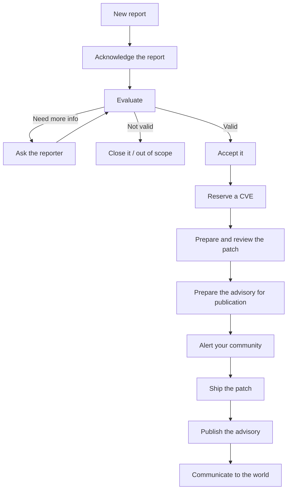

> **You are here if:** a private report just landed in your Security tab and you are not sure what to do.

**TL;DR**
- Vulnerabilities are handled in private for one reason: a public bug is a public exploit before users can patch.
- The mental model: a private workspace, a public moment when you publish, and very little in between that the world ever sees.
- The three don'ts: don't take it public, don't go silent, don't panic.

Before any of the mechanics, two mental models make the rest of this guide make sense: why this is private at all, and how GitHub's advisory machinery is shaped around that.

## Why it is private: the disclosure-risk model

A normal bug you fix in the open. A security bug you do not, and the reason is timing. The moment a vulnerability is visible (in an issue, a pull request, a commit, a post), the clock starts for every user who has not patched, and attackers read public repositories faster than maintainers do. Disclose before there is a fix and you have handed out a working exploit while leaving everyone exposed.

So the whole game is sequencing: keep the vulnerability private until a fix exists and is released, then disclose. Everything GitHub gives you here (the private report, the draft advisory, the temporary private fork) exists to let you build and ship the fix without tipping anyone off first. This is the principle the rest of the guide keeps coming back to. (The references are in [Resources](/resources#disclosure-principles-and-philosophy).)

That quiet window between a private report and public disclosure has a name: the **embargo**. It is the period everyone who knows agrees to hold off while the fix is built and shipped. An embargo is a social agreement, not a GitHub setting: its length is whatever you, the reporter, and any coordinated parties agree to, often anchored to the reporter's own disclosure deadline. You negotiate it and you manage it; nothing enforces it for you (more on timing in [§7](/guide/coordinating-publication)).

## How GitHub's advisory works: the mental model

Three things to hold in your head:

- **A private workspace.** The draft advisory, its conversation, and the temporary private fork are all private to you and the collaborators you add. This is where the work happens.
- **A public moment.** When you click publish, the advisory record goes public and flows out to the wider ecosystem. Before that, nothing does.
- **Very little crosses over.** Of the whole private conversation, only the reporter's original report becomes public on publication; the rest stays private forever ([§2](/guide/reading-the-advisory) covers exactly who sees what).

## The lifecycle at a glance

## The three don'ts

- **Don't take it public.** No public branch, no public pull request, no "fixing a security issue" commit message, no details in an issue, until the advisory is out ([§5](/guide/preparing-the-fix), and the [cheatsheet gotchas](/cheatsheet#avoiding-the-gotchas)).
- **Don't go silent.** Acknowledge the report, even before you have assessed it. Silence is what makes a reporter escalate ([§3](/guide/acknowledging-the-report)).
- **Don't panic.** You almost always have more time and more control than it feels like in the first five minutes. The rest of this guide is the calm version of what to do next.
