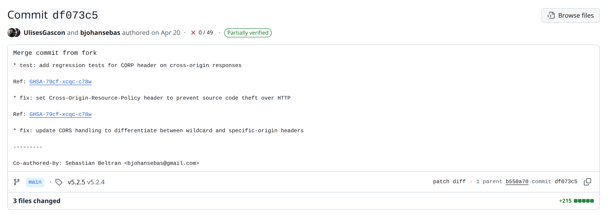

> **You are here if:** you accepted the report and need to get a fix ready without tipping off the world.

**TL;DR**
- Check whether it is already fixed before you write anything.
- Decide where to work: the temporary private fork, a private clone that keeps your tooling, or even the public repo if early disclosure is not a concern.
- Keep the fix minimal: one focused commit, regression tests where you can, no refactors.
- Test against the oldest runtime and version you support; there is no CI to catch a regression for you.
- Backport to every supported line, and hold the patch until you are ready to publish (see [§7](./coordinating-publication.md)).

The hard part here is rarely the code. It is producing a correct, minimal fix in private, often without the CI and tooling you normally lean on. Three questions follow: is there even a fix to write, where do you write it, and how do you keep it small and correct.

## Is it already fixed?

Sometimes there is nothing to write. Before you open anything, check whether the issue is already resolved:

- It was patched in a later release, and nobody realized the change closed a security hole.
- The reporter included a patch.
- You fixed it earlier as part of an unrelated change.
- Someone proposed a fix in the open. Scan the existing pull requests and issues; the bug may already be solved, in part or in full, in a public PR.

If so, find the exact commit or version that fixes it and confirm it really does, ideally with a test that fails on the vulnerable version and passes on the fixed one. Then move on to [preparing the advisory](./preparing-the-advisory.md).

Already fixed does not mean "no advisory." If the fix is released, you still publish so downstream learns which version to upgrade to. If the fix exists but has not shipped, you may only need to cut a release.

One more case: the vulnerability may only affect versions you no longer actively maintain. Then it is your call whether to ship an extra security release for an old line or to leave it unpatched and say so. Leaving an unmaintained version unpatched is a legitimate choice.

## Where to develop it

Where you build the fix depends on how much you rely on your tooling, and on the nature of the vulnerability.

**The temporary private fork (the dark room).** From the draft advisory, GitHub lets you start a temporary private fork: a private space, tied to the advisory, where collaborators can work on the fix. It is the native option and keeps everything in one place.

The catch is in the name. Your normal workflow does not run here: status checks and Actions do not run, and your organization secrets are unavailable. You are coding with the lights off. Workarounds (running checks locally, a manual test plan, mirroring to a private repo that does have Actions) are tracked in [LIMITATIONS.md](../limitations.md).

Access is coarse: anyone you add as a collaborator on the advisory can reach the fork, and there is no finer control than that (see [LIMITATIONS.md](../limitations.md)). Add only the people you need. The reporter can also open their own private fork and push branches or pull requests into it; that is by design.

**A private clone or private repo.** Plenty of maintainers skip the fork entirely and build the fix in a separate private repository, where their CI and secrets work normally. You keep your tooling; in exchange you keep it private and merge the fix back cleanly when you publish.

**The public repo.** If early disclosure genuinely does not matter for this issue, you can also just fix it in the open. That is unusual for a real vulnerability, but it is a valid choice when the risk of tipping people off is low.

Whatever you pick, the patch stays held until you are ready to publish. The fix becomes public the moment you ship the release, so the goal is not "never public" but "not public until you are ready to coordinate the release and the advisory together" (see [§7](./coordinating-publication.md)). Pushing the fix early, to a public branch before you are ready, is the most common way to blow an embargo (see the [cheatsheet gotchas](../cheatsheet.md#avoiding-the-gotchas)).

## Writing the fix

- **One focused commit.** Fix the vulnerability and nothing else. Drive-by refactors make the change harder to review and much harder to backport.
- **Include regression tests where you can.** They prove the fix works and stop the bug from quietly returning. A test that demonstrates the exploit is fine here; it ships with the patch, not before it. A comment pointing at the advisory helps future readers.
- **Test against the floor.** With no CI, nothing checks that your patch still runs on the oldest runtime, language version, or dependency set you support. Verify that yourself, in private. Merging a patch that breaks compatibility forces you to fix it in public, which opens an early-disclosure window while the release is half-done and the advisory is not out yet.
- **Validate the affected range.** Confirm exactly which versions are vulnerable. You need it for the advisory, and it is what tells you how far to backport.
- **Backport to every affected line you support.** Use that affected range to decide how far back to go; the vulnerability rarely touches only the latest version. Prepare a separate fix commit per branch.
- **Ask the reporter to check.** When the patch is ready, it is worth asking the reporter to confirm it closes the issue and that they cannot find another way around it.
- **Do not skip your hooks.** Reaching for `--no-verify` to get past a pre-commit check is how unsigned or unchecked code slips into a security release (see the [cheatsheet gotchas](../cheatsheet.md#avoiding-the-gotchas)).

:::note
If you discover a second vulnerability while fixing the first, you can patch both, but give the new one its own advisory rather than quietly folding it into this one.
:::

## Merging the fork (and the squashed commit)

This happens when you ship, in [§7](./coordinating-publication.md), but it shapes how you commit now, so know it in advance.

You cannot merge pull requests individually. GitHub merges all the advisory's open pull requests at once, but each one still lands on its own target branch, squashed into a single commit titled "Merge commit from fork" (your individual commit messages survive only as bullets in that commit's body). A fix backported to three branches produces three squashed merge commits, one per branch, not one combined commit on `main`:

Two consequences:

- **If you rely on commit-format automation** (conventional commits, release tooling, changelog generators), the squashed commit will not match your rules. You may need to amend and force-push it before you tag the release.
- **The history loses context.** Each branch gets one generic commit, which is why reconstructing the story afterward takes deliberate effort (see [§8](./wrapping-up.md)).

:::tip
Referencing the advisory in your commit messages is safe and worth doing. The GHSA and CVE are not publicly visible until you publish, so the links simply resolve later.
:::
