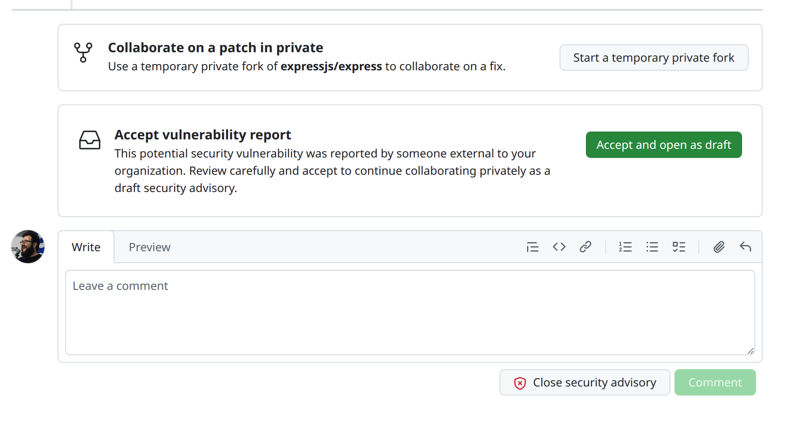

> **You are here if:** you have acknowledged the report and need to decide what to do with it: accept, reject, rescope, or send it elsewhere.

**TL;DR**
- Triage answers four questions, in order: can you reproduce it, is it actually a security issue, is it in your scope, and is it yours to fix?
- Treat the report as a set of claims to verify, not facts. Nobody checks a submission before it reaches you.
- You have the right to say no. "Out of scope" and "not a vulnerability" are legitimate, common outcomes.
- Decide validity and scope here. How bad it is comes later, in [§6](./preparing-the-advisory.md).
- Reject with your reasoning, not a brush-off. A dismissed reporter is the one who escalates.

## Why this matters

Triage is where your authority is real (see [A word on your authority](../intro.md#a-word-on-your-authority)). Most first-timers assume that once a report arrives, they are obligated to fix it. You are not. A report has to clear several bars before it becomes your problem:

- Not every report is valid.
- Not every valid bug is a security issue.
- Not every security issue is in your scope.
- Not every in-scope issue is yours to fix.

You decide where each report falls. Saying no, clearly and kindly, is a normal outcome, not a failure.

## What you are deciding

Treat everything in the report as a claim, not a fact. Nobody verifies a submission before it reaches you: some are thin, some are wrong, and some are long AI-generated text with very little inside. Your job is to check, never to assume the reporter is right.

Work through four questions in order. The first "no" usually settles it.

1. **Can you reproduce it?** Follow the steps. If you cannot, ask the reporter for a clearer proof of concept before you judge it. "I could not reproduce it" is a request for more information, not a verdict.
2. **Is it actually a security issue?** Plenty of reports are real bugs, expected behavior, or feature requests wearing a security costume. A crash on input you never promised to handle, or a "weakness" that needs the admin access you already trust, may not be a vulnerability at all.
3. **Is it in your scope?** Your threat model is the yardstick: does the report assume access, configuration, or conditions you never promised to defend against? If your project never claimed to sandbox untrusted plugins, "a malicious plugin can do X" may be out of scope by design.
4. **Is it yours to fix?** The flaw may live in a dependency, in upstream, or in how the user configured things. If so, it belongs to someone else, even if you end up bumping a version to pick up their fix.

:::warning
Do not download or run binaries, archives, or proof-of-concept files attached to a report. A security advisory is an untrusted input surface like any other: read the code, do not execute a stranger's payload.
:::

:::tip
If a report is confusing or reads like long AI-generated filler, run the original text through an LLM to get a distilled summary and a minimal proof of concept you can test. If you find yourself doing this often, it is worth investing in better prompts or tooling to keep the output accurate.
:::

Each question has an exit:

- **Accept** it and move on to [preparing the fix](./preparing-the-fix.md).
- **Close** it as out of scope or not a vulnerability.
- **Redirect** it to the dependency or upstream project that owns it.
- **Rescope** it: real, but a hardening or a lower-impact issue rather than the vulnerability as reported. (How bad it is is a [scoring](./preparing-the-advisory.md) question, not a triage one.)

:::tip
The moment you accept a report, you can reserve its CVE (see [§6](./preparing-the-advisory.md)). Getting a number assigned can take time, so reserving early means it is ready when you publish, instead of becoming the thing everyone waits on at the end.
:::

## What GitHub gives you here

At this stage GitHub offers four actions, and nothing else:

- **Start a temporary private fork** — collaborate on a fix privately (see [§5](./preparing-the-fix.md)).
- **Accept and open as a draft** — accept the report and keep working as a draft advisory. GitHub even reminds you to review carefully first.
- **Comment** — reply without deciding yet, for example to ask for a clearer proof of concept.
- **Close security advisory** — decline it. A comment is not required, but always leave one.

There is also no way to give reporters a submission template the way you can for issues or pull requests, so reports arrive in wildly varying shape and quality (see [LIMITATIONS.md](../limitations.md)).

## Editorial criteria

Triage is only as fast as your sense of scope is clear. Your editorial criteria is the standing answer to "what do we treat as a vulnerability, and what do we not?" Your threat model, what your project does and does not defend against, is the heart of it: it turns "this feels out of scope" into "this is out of scope, and here is why," and makes a rejection something you can point to rather than argue.

Ideally you wrote it down before the first report arrived. If you have not, this report is the prompt to do it; the how-to lives in [§9](./building-for-the-long-term.md).

Editorial criteria are not fixed, and they should not be. A project's sense of what counts as a vulnerability shifts over time, and a report is often what exposes a boundary you never wrote down. It is perfectly legitimate to respond by documenting that boundary, updating your threat model or your docs, and then closing the report as out of scope under the now-explicit criteria. The report did its job: it made you decide.

The one rule when you shift criteria is transparency. Do not quietly move the goalposts. Tell the reporter you are clarifying scope, point them at the change you made, and credit them for surfacing it. A documented, explained change reads as a project maturing; an unexplained one reads as dodging.

If you triage as a team, the criteria has to be shared rather than living in one person's head, so two maintainers reach the same verdict on the same report. Borderline reports, the ones sitting right on the edge of what you accept, need a safe space to talk through.

There is a catch: **the advisory thread includes the reporter in every interaction.** Anything you post there, they see. So when you need to align the team on a borderline call, do it somewhere separate, without the reporter, then report the decision back in the advisory.

:::note
Referencing an advisory from a pull request or issue does not create the automatic link-back you get between issues and PRs. If you discuss or track an advisory elsewhere, you have to keep those connections yourself. See [LIMITATIONS.md](../limitations.md).
:::

## Saying no

You are allowed to decline, and you will, often. What matters is how.

- **Give your reasoning.** Reference your scope or threat model, explain why it does not qualify, and thank them for looking. A reasoned "no" lands very differently from silence or a one-line dismissal.
- **Leave the door open.** Invite them back if they can show the missing piece: a working proof of concept, or a scenario that sits inside your threat model.
- **Stay calm if they disagree.** You have the final say on your own project, but a reporter who feels brushed off is the one who escalates, with a public issue, a blog post, or a CVE requested without you (see [§3](./acknowledging-the-report.md)). A respectful rejection is also your reputation talking.

Two real examples. The first closes a report as out of scope by pointing at a named exclusion in the project's threat model:

The second declines a report that is not a real defect, explaining the reasoning plainly:

## Other outcomes

- **Real, but not a security issue.** Close the advisory and handle it as a normal bug or feature in the open.
- **It lives in a dependency or upstream.** Redirect it to the project that owns it. You may still ship a version bump once they fix it, but the advisory is theirs to run.
- **Already known or already fixed.** You may not need to do anything but confirm the fixed version (see [§5](./preparing-the-fix.md)).
- **A hardening idea.** Defense-in-depth worth doing but not an exploitable flaw. Accept it as a normal improvement without a CVE, or decline it. Your call.
